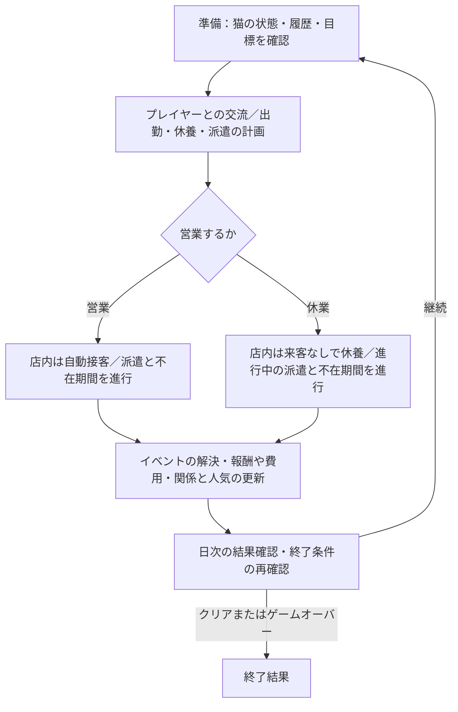

# ゲーム全体の流れと実装順の整理

2026-09-23追記：[保護猫の受け入れ依頼](HumanToCatIntakeRequest.md)を初回実装。新規ゲームの4日目に固定1匹の依頼が届き、回答・加入・費用・履歴・保存再開へ接続した。旧セーブには後付けしない。

整理日：2026-09-20 / 対象：通常の人対猫営業 / 状態：現状確認と次段階の提案

ユーザー追加案（2026-09-20）：[派遣・猫との関係・イベント・クリア目標](HumanToCatPlannedFeatures.md)を実装予定の機能案として記録した。以下の現状一覧は実装確認時点のまま維持する。4〜6節は追加案に合わせて更新し、設備先行から猫の詳細画面を起点とする実装順へ見直した。

派遣3種類・活動状態・帰還確認を初回実装した。[現行仕様](HumanToCatCafeActivities.md)を追加案の時点・条件に優先する。以下の将来案にある開店時出発に対し、初回は準備中の確認で即時出発する。

2026-09-21追記：[プレイヤー交流](HumanToCatPlayerInteraction.md)の初回実装を追加。準備中の交流枠と好感度の保存まで実装済み。[譲渡イベント](HumanToCatAdoption.md)の申し出・予防判定・ON/OFF・承諾／見送り・履歴保存も初回実装済み。

2026-09-21追記：[ストレス・家出・帰還と経営終了](HumanToCatManagement.md)の初回実装を追加。準備中に明示導入し、旧セーブは読込だけで終了判定を有効にしない。初期資金・人気・費用の暫定ルールは同仕様を優先する。

## 1. 結論と資料の位置づけ

2026-09-22追記：[猫の特性](HumanToCatTraits.md)を3種類実装。新規の初期猫・新しい加入候補から導入し、接客・休養・派遣の長所短所、表示と保存へ接続した。

2026-09-22追記：[人気獲得と期限付きクリア目標](HumanToCatPopularityGoal.md)の初回1段階を実装。新規は10日以内に人気150を目指す。旧セーブは任意導入、結果確認後は継続営業できる。

2026-09-21追記：[開始画面・独立した新規ゲーム・終了後の再開始](HumanToCatNewGame.md)を実装。通常の新規開始では経営ルールを有効化し、旧セーブは保存された設定で再開する。

2026-09-21追記：[保護猫の受け入れ](HumanToCatRecruitment.md)を初回実装。準備中に固定3匹の候補から初期費用を払って迎え、休養・出勤・派遣・交流へ接続できる。定期更新や他の加入経路は後続。特性3種類と人気目標1段階はその後初回実装済み。

現在は「準備 → 割り当てと自動交流 → 会計・閉店 → 翌日」を繰り返せる。
不足しているのは、**得た資金や関係の変化を、次の経営判断・店の成長・継続目標につなぐ部分**である。
次は個別の疲労係数を詰めるより、何を目指して営業し、成果を何に使い、翌日に何が変わるかを整理する。

[開発方針](CatCafeSimulation_ImplementationGuide.md)に従い、回復量・発症率・料金などの細かな調整と追加の長期比較は保留する。
本書の「現状」はコードと現行操作資料を照合した記述。「提案」は今後の候補であり、採用済み仕様ではない。
「未実装」は機能がないこと、「未決定」は導入範囲やルールをまだ決めていないことを示す。両方に該当する項目もある。
本書の初回整理は資料のみの変更。その後、5節の猫の詳細画面を実装した。設定・セーブ形式は維持している。

元の実装資料には旧営業の満足達成・気力回復や将来の経営要素も含まれる。
通常営業の現状把握は本書とリンク先の現行資料を優先し、旧資料のPhase番号だけで実装済みと判断しない。

## 2. いま遊べる一日の流れ

日次比較と営業セーブは既存機能。保存再開は一時停止から始まる。
閉店後は翌日へ進まず結果を再確認できる。休業操作は一日を処理して直接翌日の準備へ進む。
保存失敗時は結果を保持して進行を止め、再試行してから続ける。

| 段階 | 現在プレイヤーが判断すること | 自動で進むこと | 全体の流れで不足すること |
|---|---|---|---|
| 起動 | 開始画面で新規／セーブ再開を選ぶ。試遊は参加猫や保存先を指定可能 | 新規は専用保存先へ初期猫・資金・経営ルールを用意 | 難易度や初期条件のカスタマイズ |
| 営業前 | 猫ごとの出勤・休養、休養案の編集、営業／休業 | 保存した予定の適用、休業時の一日処理 | 次の目標、資金の使い道、将来の来客を見て準備する情報 |
| 営業中 | 待機客・猫・空席の選択、手動／自動割り当て、一時停止・再開 | 交流コマンド、猫の反応・特別行動、退店会計 | 設備や関係の成長が担当選びにどう影響するか |
| 閉店後 | 成果と日次比較を見て翌日の担当・休養を考える | 疲労・病気更新は閉店処理で一度確定済み | 次の投資や目標進捗へのつながり |
| 翌日 | 引き継いだ予定を調整し再び営業する | 体力回復、所持金・親しみ・疲労・体調の持ち越し | 同じ来店予定の反復を越える変化、店の発展 |

プレイヤーは通常営業で交流コマンドを選ばない。担当中の猫の交代や手動切り上げも通常画面の操作には含まれない。
検証用の `--manual` や単独交流画面にある操作を、そのまま通常プレイの判断として数えない。

2026-09-22追記：[猫の特徴とお客さんの好み](HumanToCatCustomerPreferences.md)の初回実装を追加。新規ゲームでは毛色・毛の長さと1人1つの好みを照合し、通常テンション上昇を補正する。配置前に相性を比較できる。自動配置の優先順位と顧客名簿全体は従来の範囲を維持する。

## 3. 実装済み・未実装・未決定の整理

| 要素 | 状態 | 確認できた内容／残る範囲 |
|---|---|---|
| 複数猫・席への割り当て | 実装済み | 既定2席、資金で3席へ増設可能。猫・客の二重配置を拒否。体力優先の自動割り当てもある |
| 交流と個性 | 実装済み | 固定方策が働きかけを選び、猫の好み・反応を反映。通常営業は学習済み猫AIではない |
| 出勤・休養・休業 | 実装済み | 疲労順2匹休養の編集可能な提案、全猫休養、来客なしの休業 |
| 健康管理 | 実装済み | 疲労持ち越し、発症、療養と復帰。翌日の体力全回復は維持 |
| 売上と所持金 | 実装済み | 時間料金＋特別行動ボーナスを会計し、所持金を持ち越す |
| 日次結果・比較・保存再開 | 実装済み | 複数日の売上・猫の成果等を確認し、途中状態も保存できる |
| 猫から客への親しみ | 実装済み／効果は未決定 | 組み合わせ別に蓄積・保存。段階表現がある。親しみによる交流効果・料金・来店確率の補正は未導入 |
| 猫の登録・参加・加入 | 保護猫受け入れの初回実装済み | 登録済み猫の起動時参加・テスト猫5匹に加え、準備中に資金を使って初回3匹と3日ごとの追加候補から迎えられる。以前の候補も保持する |
| 再来店 | 最小限のみ実装済み | 固定IDの客が翌日も来る。既存の来店経験と猫別親しみを使う |
| 顧客名簿・曜日・常連 | 名簿と曜日来店を初回実装 | [表示名・好み・来店回数・猫別親しみ・当日の予定](HumanToCatCustomers.md)を閲覧できる。[曜日別来店・今日と翌日の予定](HumanToCatWeekdays.md)を新規ゲームに導入。常連度・来店確率は後続 |
| 客満足・不満 | 一部のみ実装済み／接続未決定 | 待機期限・列満杯の不満は記録。版4交流の成果を独立した客満足や累積不満・離脱へ接続していない |
| 設備の購入・設置・効果 | 休養スペース・接客設備を初回実装 | 準備中に暫定400で購入し、在店休養時の疲労回復＋10。予測・支出・保存に反映。[仕様](HumanToCatRestEquipment.md)。[席ごとの接客設備2種類](HumanToCatSeatEquipment.md)も購入・移動・取り外し・効果・保存まで実装済み |
| 席の増設 | 2席→3席を初回実装 | 準備中に暫定500で一度購入。接客・派遣条件・支出履歴・保存再開に反映。[仕様](HumanToCatExpansion.md)。4席以上と1席からの拡張は後続 |
| 猫の特性・能力成長 | 特性3種類を実装／能力成長は未実装 | 接客・休養・派遣に長所と短所を適用。経験値、レベル、能力強化は後続。個性の編集を成長として扱わない |
| 支出・経営の失敗 | 明示導入する初回ルールを実装 | 子猫は預け先・譲渡費用のみとし、資金0でゲームオーバーとする追加方針。家出時の人気低下と、人気が下がりきった場合のゲームオーバー案も追加。家賃等は未導入 |
| 長期目標・終了条件 | 人気目標1段階・有力者目標とゲームオーバーを実装 | 10日以内に人気150でクリアし、結果確認後も継続可能。資金0以下・人気0で終了。有力者への派遣帰還でも独立してクリア可能。好感度80以上の在籍猫6匹の任意目標も実装済み。人気目標の多段階化は後続 |

通常営業は旧営業の満足目標達成を成功条件にしていない。関心・テンション・親しみも、それぞれ別の値である。
特別行動の両側発動や低体力からの達成を、ゲーム全体のクリア条件に戻さない。
100日の自動比較は開発用の検証期間であり、100日でゲーム終了する仕様ではない。

## 4. 追加機能を含めた一日の流れ（設計提案）

この節以降は将来の処理案であり、2節の現行動作とは区別する。ユーザー指定の機能・終了条件は[実装予定機能案](HumanToCatPlannedFeatures.md)を維持し、未指定の順序・状態の扱いをここで提案する。

図は一日の大枠。資金や人気の終了判定を日末まで先送りする意味ではなく、確定した変化ごとにも判定する案とする。

| 時点 | プレイヤーの判断 | 処理する内容の案 |
|---|---|---|
| 準備開始 | 詳細画面で猫の体力・疲労・関係・履歴を確認 | 帰還済みか、不在か、療養中かを区別し、可能な活動だけ選べるようにする |
| 準備中の交流 | 在店猫と決まったターン数遊ぶ | プレイヤーとの関係を別に更新。回数枠・ターン消費を記録し、画面の開き直しでは回復しない |
| 活動計画 | 店内出勤・休養・条件の合う派遣先を選ぶ | 計画中と実行中を区別。単なる画面操作や計画の取り消しでは報酬を発生させない |
| 営業開始 | 手動／自動割り当てを選んで開始 | 派遣の出発を確定し、その猫を店内割り当てから除く。店内の交流コマンドは従来どおり自動 |
| 営業中 | 状況確認・一時停止、必要なイベント選択 | 店内接客を進め、派遣中イベントの条件を確認。選択待ちは全体を止め、同じ時点を重複処理しない |
| 日末 | 成果・損失・帰還予定を確認 | 未完了接客を精算。既存の疲労・療養更新を一度行い、新しい日次状態変化、派遣進行・帰還、イベントを整理する |
| 次の日へ | 継続時に翌日の配置を考える | 日付を一度進めて準備へ戻る。終了条件成立時は通常の翌日操作へ戻さない |

### 休養・休業とプレイヤー交流

「休みのとき」は、まず在店猫の休養日・店の休業日にある交流枠として扱う案とする。営業中の任意の空き時間へ無制限に追加する案にはしない。
初回は営業前または休業確定前に交流を選び、その後に営業／休業の一日を進める。初回仕様は店全体で1日3セット、各最大10ターンのコマンド交流。療養中は対象外、体力は接客と共有し、疲労は変えない。[現行仕様](HumanToCatPlayerInteraction.md)を参照。

休業は店内の来客を止め、在店猫を休養にする。提案済みで未出発の派遣は休業時に取り消し、新規派遣は出さない案。
既に派遣中・行方不明の猫は、休業で瞬間帰還せず期間が進む。不在猫に在店の休養回復を自動適用することは決めない。
初回派遣では在店と派遣を区別し、休業中も派遣期間を進めるように実装した。準備中の出発後に休業を選ぶこともできる。

### 猫の状態と活動の可否（提案）

所在地・所属と健康状態を分ける。病気になった派遣猫などを一つの状態名で無理に表現しない。

| 所属・所在地／活動 | 店内の担当・プレイヤー交流 | 翌日以降と記録 |
|---|---|---|
| 在店・出勤予定 | 健康などの担当条件を満たせば店内接客。準備中の交流は別枠 | 猫IDと関係を保持 |
| 在店・休養予定 | 接客対象外。プレイヤー交流の可否は交流ルールで判定 | 休養実績を残す。療養中は出勤・新規派遣を不可とする案 |
| 派遣中 | 店内接客・プレイヤー交流・別の派遣へ同時参加不可 | 派遣先、残期間、成果を保持。帰還した猫は次の準備から配置可能にする案 |
| 家出・行方不明 | 新たな接客・交流・派遣不可 | 同じ猫ID・関係・履歴と不在期間を保持。帰還を別イベントで記録 |
| 譲渡済み | 在籍中の割り当て対象から外す | 過去の猫・客との関係や履歴は消さない。6匹目標の対象から除外する |
| 連れ帰った子猫 | 所属猫や活動対象として登録しない | 預け先への引き渡し・譲渡費用のみ記録。6匹にも算入しない |

接客中に家出などが発生する場合は、進行中の交流の終了・会計方法を定めてから猫を不在へ移す。派遣中の家出は派遣の中断結果を記録し、通常帰還の報酬を重複付与しない。
猫の特性はこの状態管理とは別のパッシブ効果として扱い、派遣条件・ストレス・接客等への適用箇所を個別に決める。

### イベントを処理する時点と終了判定（提案）

1. 行動・接客終了・派遣進行などのきっかけを確定する。
2. 条件を満たしたイベントを発生済みIDとともに記録する。選択が必要なら進行を止める。
3. 解決結果として資金・アイテム・関係・人気・所属や所在地をまとめて一度だけ更新する。
4. その確定結果で資金0・人気下限のゲームオーバーを確認し、成立しなければクリア条件を確認する。
5. 継続可能な場合だけ次のイベント・時間進行へ移る。日末にも期限付き目標を含めて再確認する。

初回は資金0以下で終了。明示導入時に所持金を最低1,000まで一度だけ補充し、新規・旧セーブとも未導入の間は終了判定を適用しない。[現行仕様](HumanToCatManagement.md)を参照。
人気目標の初回実装では、同じ閉店でクリアとゲームオーバーが重なる場合はゲームオーバーを優先する。
初回は人気0で終了し、その店は閲覧・保存のみとする。「結果・再開始…」から別の新規ゲームを始められる。人気目標は期限当日の閉店までを含めて判定する。他のクリア案との併存は後続。

| イベント | 判定・解決時点の案 | 守る内容 |
|---|---|---|
| 派遣先の出来事・成果 | 派遣の進行時、成果の精算は帰還または中断の確定時 | 現金・アイテム・有力者満足度を区別して記録 |
| 譲渡の引き取り | 客との交流が終わり関係が確定した時点に候補を判定 | ON/OFFを参照。プレイヤーとの関係による予防を反映。初回の承諾／見送り・条件は[譲渡仕様](HumanToCatAdoption.md)を参照 |
| 家出 | ストレス等の状態更新後や派遣中の出来事から判定 | 家出成立時に一度だけ人気を下げ、不在中の毎日を新たな家出として減点しない案 |
| 帰還・子猫 | 不在期間の進行による帰還確定時 | 元の猫を戻し、子猫は外部への引き渡し費用のみ精算。資金0の判定につなぐ |

複数イベントは、確定した発生時点と順序を保存する。譲渡と家出などが同じ猫で競合したら、先の解決後に後続条件を再確認する案。
セーブ再開で抽選・費用・報酬・人気低下をやり直さない。既存の閉店処理で確定済みの疲労・健康を、結果画面やイベント表示でもう一度更新しない。

## 5. 最初の実装：猫の詳細画面（初回完了）

**現在ある情報を猫ごとに確認できる詳細画面を追加した。** 派遣・関係・健康の判断材料を同じ場所に集め、後続機能の表示先にする。
初回の実装範囲と後続の履歴計画は[猫の詳細画面](HumanToCatCatDetailsPlan.md)にまとめた。

初回は名前・個性・体力・疲労・体調・出勤予定、相手別の親しみ、猫別の日次活動実績を表示する。
特性は実装済みの名前と効果を表示し、特性のない猫は「なし」と示す。
毎行動の履歴は軽量セーブに残っていないため、日次実績と区別する。最初の画面だけで、ユーザー案の詳細な行動履歴すべてが完了したとは扱わない。

## 6. 更新した実装順と仕様化の区切り（提案）

以前の設備購入先行案を置き換え、次の順にする。各段階のルールを具体化してから実装し、全機能の数値調整を先行させない。

| 順序 | 作業 | 完了条件／次へ進む前に決めること |
|---|---|---|
| 1（初回完了） | 猫の詳細画面と既存実績の閲覧 | 現在値・相手別親しみ・日次実績を猫別に確認。閲覧で状態を変えず、保存再開後も記録の範囲を正しく示す |
| 2（派遣用の初回基盤完了） | 一日の進行・猫の所属と活動状態・イベントの基盤 | 在店／派遣／不在／譲渡の区別、選択待ち・解決・履歴と保存を扱える。必要な新規開始・旧セーブ移行方針も決める |
| 3（出発・帰還・資金報酬完了、中断は後続） | 派遣3種類と報酬 | 条件・期間・出発・帰還・中断・報酬を一巡させる。アイテムを報酬にする前に所持と用途を決める |
| 4（初回完了） | プレイヤー交流と譲渡 | 相手別関係、交流枠、引き取りの予防とON/OFFを接続。準備・休業との時間関係を確定する |
| 5（在店猫の家出から帰還・終了まで初回完了） | ストレス・家出・人気・費用とゲームオーバー | 家出から人気低下、帰還時の子猫費用、資金0／人気下限での終了を通す。不可避の費用を導入する段階で資金終了判定も導入する |
| 6（特性・加入・人気目標の初回完了） | 特性・猫の加入とクリア目標 | 候補の定期追加・受け入れ・費用・保存を実装済み。人気目標の進捗・達成と継続も初回実装済み。特性3種類の効果と表示・保存も初回実装済み。複数特性・有力者1人の満足度目標も実装済み。好感度80以上の在籍猫6匹の任意目標も実装済み。人気目標の多段階化は後続。継続的な加入経路は対応済み。6匹目標の条件・判定・保存も実装済み |
| 後続 | 設備・席拡張・顧客と曜日・能力成長 | 上の流れを遊んだ上で追加順を判断。必要な顧客IDや表示などの最小基盤は前段で先に整える |

猫を増やす方法は[加入方法の案と優先度](HumanToCatRecruitmentPlan.md)に整理した。ユーザー指定によりスカウトは実装負担が大きいため低優先度とし、加入や6匹達成の必須経路にしない。[保護猫受け入れ](HumanToCatRecruitment.md)を先行実装し、購入・イベント加入へ共通処理を広げる案。

初回派遣の条件は既存パラメータから始め、未実装の特性を必須にして順序3を止めない。
[有力者への派遣と満足度目標](HumanToCatPatronGoal.md)を実装済み。資金報酬とは別に帰還受取で満足度を確定する。
人気目標を最初の1段階として実装済み。有力者目標とは独立して達成できる。[猫との好感度目標](HumanToCatBondGoal.md)も任意で開始でき、すべてを強制同時達成にしない。

各段階では、手動／自動割り当て、休養・休業、保存再開の既存経路を維持する。
追加した経路は「準備で選ぶ → 一日を進める → 結果を見る → 次の配置を変える」までを通して確認する。
未解決イベントの保存再開、同じ猫への二重配置、報酬・費用・健康更新の二重適用、終了後の翌日進行を確認対象にする。
この検証は流れと整合性の確認であり、細かな係数調整や長期バランス比較の再開ではない。

## 7. 照合した資料と実装

| 確認対象 | 資料 | 主な実装 |
|---|---|---|
| 通常操作・役割分担 | [自動交流](HumanToCatAutomaticCafe.md)、[複数席](HumanToCatMultiSeatCafe.md)、[参加猫](HumanToCatCafeRoster.md) | [営業セッション](../cat_cafe_sim/cafe_interaction.py)、[営業画面](../cat_cafe_sim/cafe_interaction_gui.py)、[複数席core](../cat_cafe_sim/core/multi_seat_cafe.py) |
| 交流・関係・会計 | [営業接続](HumanToCatCafeIntegration.md)、[親しみの表現](HumanToCatRelationshipPresentation.md) | [営業core](../cat_cafe_sim/core/cafe_interaction.py)、[親しみ計算](../cat_cafe_sim/core/human_cat_relationship.py)、[自動方策](../cat_cafe_sim/policies/human_cat.py) |
| 日程・健康・休業 | [翌日と比較](HumanToCatCafeDays.md)、[出勤・休養](HumanToCatCafeShifts.md)、[病気](HumanToCatCafeHealth.md)、[休業](HumanToCatCafeDayOffPlan.md) | 営業coreの `next_day`・`day_off`・閉店処理、[休養提案画面](../cat_cafe_sim/cafe_shift_gui.py) |
| 保存と再開 | [営業セーブ](HumanToCatCafeSaves.md)、[軽量形式](HumanToCatCompactSaves.md) | [営業保存](../cat_cafe_sim/storage/cafe_saves.py)、[関係保存](../cat_cafe_sim/storage/relationships.py) |
| 未導入の経営要素 | [原案・実装資料](CatCafeSimulation_ImplementationGuide.md)の設備・常連・未確定事項 | [モデル](../cat_cafe_sim/core/models.py)に設備欄はあるが、購入・成長・曜日の処理は未導入 |

既存の[複数日テスト](../tests/test_cafe_days.py)、[休業テスト](../tests/test_cafe_day_off.py)、[保存テスト](../tests/test_cafe_saves.py)も照合対象にした。
初回の資料整理時はゲームのテストを再実行していない。後から追加した猫の詳細画面の検証結果は[実装記録](HumanToCatCatDetailsPlan.md)を参照。

## 現在の画面構成

通常営業UIは「営業」「準備・お店」「結果・記録」に整理。操作経路と一時停止の扱いは[通常営業UIの構成](HumanToCatUIFlow.md)を参照。

## 派遣中の選択イベント

商店街・郊外への新規出発分に、1日目終了時の選択イベントを追加した。回答待ちは営業画面の案内欄から直接開ける。選択後の報酬・疲労・ストレス、保存互換は[派遣中の選択イベント](HumanToCatDispatchEncounters.md)を参照。既に出発済みの派遣には後付けしない。
