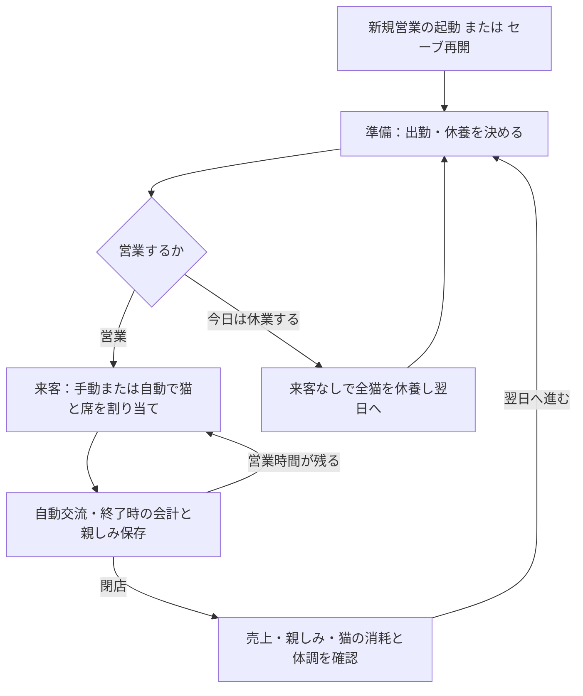

# ゲーム全体の流れと実装順の整理

整理日：2026-09-20 / 対象：通常の人対猫営業 / 状態：現状確認と次段階の提案

ユーザー追加案（2026-09-20）：[派遣・猫との関係・イベント・クリア目標](HumanToCatPlannedFeatures.md)を実装予定の機能案として記録した。以下の現状一覧は実装確認時点のまま維持し、設備を先行する実装順は追加案を踏まえて見直す候補とする。

## 1. 結論と資料の位置づけ

現在は「準備 → 割り当てと自動交流 → 会計・閉店 → 翌日」を繰り返せる。
不足しているのは、**得た資金や関係の変化を、次の経営判断・店の成長・継続目標につなぐ部分**である。
次は個別の疲労係数を詰めるより、何を目指して営業し、成果を何に使い、翌日に何が変わるかを整理する。

[開発方針](CatCafeSimulation_ImplementationGuide.md)に従い、回復量・発症率・料金などの細かな調整と追加の長期比較は保留する。
本書の「現状」はコードと現行操作資料を照合した記述。「提案」は今後の候補であり、採用済み仕様ではない。
「未実装」は機能がないこと、「未決定」は導入範囲やルールをまだ決めていないことを示す。両方に該当する項目もある。
今回、実行コード・設定・セーブ形式は変更しない。

元の実装資料には旧営業の満足達成・気力回復や将来の経営要素も含まれる。
通常営業の現状把握は本書とリンク先の現行資料を優先し、旧資料のPhase番号だけで実装済みと判断しない。

## 2. いま遊べる一日の流れ

日次比較と営業セーブは既存機能。保存再開は一時停止から始まる。
閉店後は翌日へ進まず結果を再確認できる。休業操作は一日を処理して直接翌日の準備へ進む。
保存失敗時は結果を保持して進行を止め、再試行してから続ける。

| 段階 | 現在プレイヤーが判断すること | 自動で進むこと | 全体の流れで不足すること |
|---|---|---|---|
| 起動 | 新規起動／セーブ再開、参加猫や保存先の指定 | 登録済み猫の読込 | 通常画面から新しい店を始める導線と初期条件の案内 |
| 営業前 | 猫ごとの出勤・休養、休養案の編集、営業／休業 | 保存した予定の適用、休業時の一日処理 | 次の目標、資金の使い道、将来の来客を見て準備する情報 |
| 営業中 | 待機客・猫・空席の選択、手動／自動割り当て、一時停止・再開 | 交流コマンド、猫の反応・特別行動、退店会計 | 設備や関係の成長が担当選びにどう影響するか |
| 閉店後 | 成果と日次比較を見て翌日の担当・休養を考える | 疲労・病気更新は閉店処理で一度確定済み | 次の投資や目標進捗へのつながり |
| 翌日 | 引き継いだ予定を調整し再び営業する | 体力回復、所持金・親しみ・疲労・体調の持ち越し | 同じ来店予定の反復を越える変化、店の発展 |

プレイヤーは通常営業で交流コマンドを選ばない。担当中の猫の交代や手動切り上げも通常画面の操作には含まれない。
検証用の `--manual` や単独交流画面にある操作を、そのまま通常プレイの判断として数えない。

## 3. 実装済み・未実装・未決定の整理

| 要素 | 状態 | 確認できた内容／残る範囲 |
|---|---|---|
| 複数猫・席への割り当て | 実装済み | 既定2席。猫・客の二重配置を拒否。体力優先の自動割り当てもある |
| 交流と個性 | 実装済み | 固定方策が働きかけを選び、猫の好み・反応を反映。通常営業は学習済み猫AIではない |
| 出勤・休養・休業 | 実装済み | 疲労順2匹休養の編集可能な提案、全猫休養、来客なしの休業 |
| 健康管理 | 実装済み | 疲労持ち越し、発症、療養と復帰。翌日の体力全回復は維持 |
| 売上と所持金 | 実装済み | 時間料金＋特別行動ボーナスを会計し、所持金を持ち越す |
| 日次結果・比較・保存再開 | 実装済み | 複数日の売上・猫の成果等を確認し、途中状態も保存できる |
| 猫から客への親しみ | 実装済み／効果は未決定 | 組み合わせ別に蓄積・保存。段階表現がある。親しみによる交流効果・料金・来店確率の補正は未導入 |
| 猫の登録・参加 | 試遊用の仕組みは実装済み | 登録済み猫を起動時に参加させ、テスト猫5匹を追加可能。店の経営で猫を迎える機能とは異なる |
| 再来店 | 最小限のみ実装済み | 固定IDの客が翌日も来る。既存の来店経験と猫別親しみを使う |
| 顧客名簿・曜日・常連 | 未実装／詳細未決定 | 顧客の表示名や来店曜日、常連度、将来の来店予定を判断材料にする仕組みがない |
| 客満足・不満 | 一部のみ実装済み／接続未決定 | 待機期限・列満杯の不満は記録。版4交流の成果を独立した客満足や累積不満・離脱へ接続していない |
| 設備の購入・設置・効果 | 未実装／効果未決定 | 席の `equipment` 欄はあるが、購入処理や効果はない。設備名・補正は原案の候補 |
| 席の増設 | 未実装／上限未決定 | 1席／2席の起動選択は検証設定であり、営業資金での増設ではない |
| 猫の加入・能力成長 | 未実装／方式未決定 | 経験値、レベル、能力強化、加入条件はない。個性の編集を成長として扱わない |
| 支出・経営の失敗 | 未実装／終了条件の指定あり | 子猫は預け先・譲渡費用のみとし、資金0でゲームオーバーとする追加方針。家出時の人気低下と、人気が下がりきった場合のゲームオーバー案も追加。家賃等は未導入 |
| 長期目標・終了条件 | 未実装／未決定 | 店の目標、達成表示、キャンペーン終了やゲームオーバーはない |

通常営業は旧営業の満足目標達成を成功条件にしていない。関心・テンション・親しみも、それぞれ別の値である。
特別行動の両側発動や低体力からの達成を、ゲーム全体のクリア条件に戻さない。
100日の自動比較は開発用の検証期間であり、100日でゲーム終了する仕様ではない。

## 4. つなげたい経営の流れ（提案）

目指す最小の流れは「目標を見る → 準備する → 営業する → 成果を確認する → 資金を使って店を変える → 次の営業で変化を感じる」とする案。
営業を重ねた結果を、お金の累積表示だけで終わらせない。

### 資金の使い道と店の成長

最初の支出候補は、既存の席に置く設備の購入・設置とする。原案の「資金で席をカスタマイズする」に沿い、席数や猫数の増減を同時に実装せずに済む。
初回は1種類の設備で、購入前の説明、資金消費、設置、次回営業への効果、翌日・保存再開への持ち越しまでを通す案。
購入だけできて効果がない状態や、見た目だけ変わって説明がない状態では完了としない。

設備の具体的な効果は未決定。遊び／触れ合いへの補正など原案の候補を、現行交流のどの値へ反映するかから決める。
設備と猫の好みを変える処理は区別し、価格・効果量の最適化は後回しにする。維持費・売却・複数設置・増設は初回必須にしない案。

### 猫・お客との関係と翌日の変化

最初の関係の積み重ねには、既存の「猫からお客への親しみ」を使う案。
同じお客と再会し、どの猫との関係が育ったかを確認して担当を考える。新たな経験値・レベルを同時に導入する必要はない。
ただし現状の親しみは効果補正を持たないため、「親しい猫なら収益が上がる」と説明しない。

後続で顧客名簿・来店履歴・曜日別の来店情報を整え、先の来客を見て休養や担当を計画する流れを作る案。
客から猫へのお気に入り、常連化・離脱、親しみの数値効果は別途決める。新規客抽選や曜日需要を全部まとめて導入しない。

### 何を目指すか

最初は設備導入や再会などの到達点を表示し、達成後も営業を続けられる方式を提案する。
例えば「初営業を終える → 初めて設備を導入する → 同じお客との関係の進展を確認する」という導線を作る。
これは達成条件の候補であり、必要な売上額・親しみ閾値・日数・報酬は今回確定しない。

日々の成果は売上、関係の変化、猫の負担を並べて振り返る。一つの成否フラグや売上だけで良い営業を決めない。
健康を維持しつつ店を育てることを方向性とし、発症したら即敗北、休業したら失敗といった条件は追加しない。
資金0でのゲームオーバーはユーザー指定として追加された。猫への過酷な状況で家出が増え、家出時に店の人気が下がり、下がりきったらゲームオーバーとなる案も[実装予定機能案](HumanToCatPlannedFeatures.md)に記録した。いずれも未実装。追加されたクリア案には、日数制限のある段階別の人気目標、有力者への派遣、好感度の高い猫22匹がある。従来の継続型の案と合わせ、採用する目標と達成後の扱いを検討する。

## 5. 次に決めること

| 未決定事項 | 最初の推奨案 | 確認する意味 |
|---|---|---|
| 最初に通す体験 | 一度営業し、設備を購入し、次の営業で効果を確認する | 資金を稼ぐ理由と持ち越しをつなぐ |
| 始め方 | 通常画面から新規／続きからを選び、初期猫と席を案内する | 試遊用の事前登録やCLI指定への依存を減らす |
| 初期編成 | 小さな固定編成から始める。頭数・席数は別途決める | テスト用5匹を製品の初期条件として自動確定しない |
| 新しい店の保存範囲 | 店ごとの資金・猫・顧客・関係を区別する | 新規開始で既存の関係保存を誤って共有・上書きしない |
| 初回設備 | 既存席に1種類・1効果から導入する | 現行交流へどう効果を接続するかを先に決める |
| 最初の目標 | 到達点の表示と達成後の継続 | 資金0の終了条件・人気低下の終了案と、クリア条件の関係を決める |
| 関係の位置づけ | まず再会と成長の確認に使う | 見た目の変化と数値効果を混同しない |

以上は提案であり、未決定のまま実装済みの仕様として扱わない。
特に初期編成、設備の効果、保存範囲、最初の目標は、対応する実装に入る前に仕様へ具体化する。

## 6. 実装順の提案と完了条件

| 順序 | 作業 | 完了とする状態 |
|---|---|---|
| 0 | 最初の通しプレイの仕様化 | 前節の初期条件・設備1種類の効果・保存範囲・最初の目標を明示できる。数値最適化はしない |
| 1 | 新規／再開と営業準備の導線 | 初めての人が猫と店の状態、次にできることを把握して営業を始められる。既存セーブも再開できる |
| 2 | 資金を使う設備1種類 | 準備中に効果と費用を見て購入・設置し、資金と所有状態が一度だけ更新される。残高不足では変わらない |
| 3 | 翌日の変化と目標への接続 | 閉店結果から目標の進捗を見て次の準備へ進める。設備効果が次の営業で働き、保存再開しても保持される |
| 4 | 顧客情報と先を見た準備 | 固定IDの再会を土台に、顧客・来店履歴・曜日情報を確認して担当と休養を計画できる |
| 5 | 通しプレイで不足を確認 | 下記の経路を遊び、迷う箇所や判断材料の不足を修正。猫加入・能力成長・席拡張などの順序を改めて決める |

**直近の候補は追加機能案を含めた順序0の仕様化。** 設備を何種類も追加したり、回復量比較を再開したりすることを先行させない。
順序1〜3を最初の小さな完成範囲とし、「営業して設備へ投資し、次の営業へ返る」一巡を優先する。
顧客・猫成長・常連化をすべて揃えるまで通しプレイできない構成にはしない。

通しプレイでは、通常営業の手動／自動割り当て、閉店結果、設備購入後の翌日、休養提案と全店休業、途中保存からの再開を確認する。
休業でも療養と日付が進むこと、購入や会計が再開・再試行で二重適用されないことを維持する。
目標達成後に営業を継続できるかは、終了条件と合わせて確定する。購入費用に足りなくても残金があり終了条件に該当しない場合は営業へ戻れること、資金0や人気下限の終了条件が成立した場合はゲームオーバーへ進むことを確認する。
これは進行・操作・保存の確認であり、収益の最適化や100日比較を再開する条件ではない。

## 7. 照合した資料と実装

| 確認対象 | 資料 | 主な実装 |
|---|---|---|
| 通常操作・役割分担 | [自動交流](HumanToCatAutomaticCafe.md)、[複数席](HumanToCatMultiSeatCafe.md)、[参加猫](HumanToCatCafeRoster.md) | [営業セッション](../cat_cafe_sim/cafe_interaction.py)、[営業画面](../cat_cafe_sim/cafe_interaction_gui.py)、[2席core](../cat_cafe_sim/core/multi_seat_cafe.py) |
| 交流・関係・会計 | [営業接続](HumanToCatCafeIntegration.md)、[親しみの表現](HumanToCatRelationshipPresentation.md) | [営業core](../cat_cafe_sim/core/cafe_interaction.py)、[親しみ計算](../cat_cafe_sim/core/human_cat_relationship.py)、[自動方策](../cat_cafe_sim/policies/human_cat.py) |
| 日程・健康・休業 | [翌日と比較](HumanToCatCafeDays.md)、[出勤・休養](HumanToCatCafeShifts.md)、[病気](HumanToCatCafeHealth.md)、[休業](HumanToCatCafeDayOffPlan.md) | 営業coreの `next_day`・`day_off`・閉店処理、[休養提案画面](../cat_cafe_sim/cafe_shift_gui.py) |
| 保存と再開 | [営業セーブ](HumanToCatCafeSaves.md)、[軽量形式](HumanToCatCompactSaves.md) | [営業保存](../cat_cafe_sim/storage/cafe_saves.py)、[関係保存](../cat_cafe_sim/storage/relationships.py) |
| 未導入の経営要素 | [原案・実装資料](CatCafeSimulation_ImplementationGuide.md)の設備・常連・未確定事項 | [モデル](../cat_cafe_sim/core/models.py)に設備欄はあるが、購入・成長・曜日の処理は未導入 |

既存の[複数日テスト](../tests/test_cafe_days.py)、[休業テスト](../tests/test_cafe_day_off.py)、[保存テスト](../tests/test_cafe_saves.py)も照合対象にした。
今回は資料整理のためゲームのテストは再実行していない。過去の実装記録にあるテスト件数を今回の実行結果とは扱わない。
