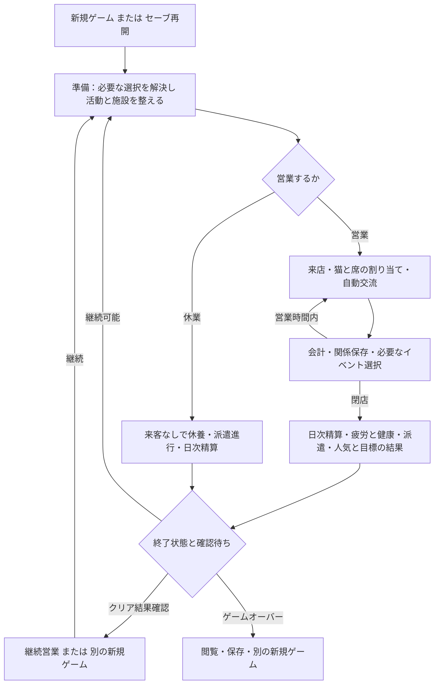

# ゲーム全体の流れと実装状況

更新日：2026-10-01 / 対象：通常の人対猫ゲーム

本書は現行機能と一日の流れをまとめる入口です。条件・数値・保存互換の詳細は機能別仕様を優先します。未着手項目は[実装予定](HumanToCatPlannedFeatures.md)、実装箇所と最新検証は[引き継ぎ](DevelopmentHandoff.md)、資料全体は[索引](README.md)を参照してください。以前の提案と追記は[整理前の記録](History/2026-09-30/HumanToCatGameFlowPlan.md)に保存しています。

## 開発方針

ゲーム全体の流れを先に固め、細かな数値調整と長期バランス比較は後回しにします。通常営業でプレイヤーが選ぶのは猫・席・活動・投資で、交流コマンドは自動です。準備中のプレイヤー交流は別の操作です。

関心・テンション、猫から客への親しみ、猫からプレイヤーへの好感度、客から店への常連度・不満、店の人気、有力者満足度を区別します。子猫は所属猫として管理せず、外部への引き渡し費用だけを処理します。スカウトは低優先度、お詫び費用は採用しません。

## 一日の流れ

```mermaid
flowchart TD
    A[新規ゲーム または セーブ再開] --> B[準備：必要な選択を解決し 活動と施設を整える]
    B --> C{営業するか}
    C -->|営業| D[来店・猫と席の割り当て・自動交流]
    D --> E[会計・関係保存・必要なイベント選択]
    E -->|営業時間内| D
    E -->|閉店| F[日次精算・疲労と健康・派遣・人気と目標の結果]
    C -->|休業| G[来客なしで休養・派遣進行・日次精算]
    F --> H{終了状態と確認待ち}
    G --> H
    H -->|継続可能| B
    H -->|クリア結果確認| I[継続営業 または 別の新規ゲーム]
    H -->|ゲームオーバー| J[閲覧・保存・別の新規ゲーム]
    I -->|継続| B
```

営業日は閉店結果を確認してから翌日へ進みます。休業は一日を処理して翌日の準備へ進みます。派遣は準備中に出発を確定し、休業中も期間が進みます。選択待ちと保存未完了は必要な進行を止め、再開時の再抽選・二重精算を防ぎます。保存再開は一時停止状態から始まります。

## 実装済みの機能

| 分野 | 現行範囲 | 詳細 |
| --- | --- | --- |
| 開始・操作 | 新規／再開／試遊、4つの目標選択、3メニューの営業画面、手動／自動割り当て | [新規開始](HumanToCatNewGame.md)、[目標選択](HumanToCatObjectiveSelection.md)、[UI](HumanToCatUIFlow.md)、[自動交流](HumanToCatAutomaticCafe.md) |
| 交流・関係 | 8種類の交流、特別行動、任意・時間・体力切れの終了、猫と客ごとの親しみ | [交流種類](HumanToCatInteractionTypes.md)、[特別行動](HumanToCatSpecialActionsSpecification.md)、[関係](HumanToCatRelationshipSpecification.md) |
| 猫の状態と成長 | 詳細とできごと、出勤・休養・疲労・療養、特性5種類、活動経験・得意分野・最大3分類・最初の分類で最大2行動・2つ目の分類で最大2行動・3つ目の分類で最大2行動の個別熟練 | [詳細](HumanToCatCatDetailsPlan.md)、[出勤](HumanToCatCafeShifts.md)、[健康](HumanToCatCafeHealth.md)、[特性](HumanToCatTraits.md)、[成長](HumanToCatCatGrowthPlan.md) |
| 加入と飼育 | 定期保護猫候補、4日目の依頼、購入、商店街・撮影スタジオ・常連からの紹介、店先に通う猫との交流と加入、6→9→12匹の飼育枠 | [加入経路](HumanToCatRecruitmentPlan.md)、[飼育枠](HumanToCatHousing.md) |
| プレイヤーとの関係 | 準備中の交流、プレイヤー好感度、任意ON/OFFの譲渡と予防 | [プレイヤー交流](HumanToCatPlayerInteraction.md)、[譲渡](HumanToCatAdoption.md) |
| 派遣 | 基本3派遣先、有力者訪問、山あいの宿、体力自慢向けの猫の運動教室、のんびり屋向けの静かな読書サロン、接客好き向けの猫の撮影スタジオ、働き者向けの猫用品の体験会、段階解放、猫ごとの派遣先比較、歓迎条件、資金・アイテム報酬、選択と帰還 | [活動・派遣](HumanToCatCafeActivities.md)、[選択イベント](HumanToCatDispatchEncounters.md)、[宿のトラブル](HumanToCatDispatchTrouble.md) |
| 施設と投資 | 2→3→4→5→6→7→8席、休養スペースの購入・1段階強化、待合の購入・2段階目の強化、従来2種＋分類別3種の接客設備 | [施設計画](HumanToCatStoreDevelopmentPlan.md)、[設備](HumanToCatSeatEquipment.md) |
| 顧客と評価 | 名簿と予定、曜日、好み・相性、満足／普通／不満、常連、累積不満、停止・回復・永久離脱 | [名簿](HumanToCatCustomers.md)、[相性](HumanToCatCustomerPreferences.md)、[評価](HumanToCatCustomerSatisfaction.md)、[常連](HumanToCatCustomerLoyalty.md)、[不満](HumanToCatCustomerDiscontent.md)、[信頼](HumanToCatCustomerTrust.md) |
| 追加客層 | 第1段階の白猫好き・静かな交流客・遊び客・触れ合い客、第2段階の予約、最終段階のVIP | [白猫好き](HumanToCatAdvancedCustomers.md)、[静かな交流客](HumanToCatQuietCustomer.md)、[遊び客](HumanToCatPlayCustomer.md)、[触れ合い客](HumanToCatContactCustomer.md)、[予約](HumanToCatReservations.md)、[VIP](HumanToCatVipCustomer.md) |
| 経営とイベント | 運営費、日次・期間収支、ケア用品・栄養おやつ・特製ケアセットの購入・使用・売却、店舗イベント、在店猫の家出と帰還 | [経営](HumanToCatManagement.md)、[運営費](HumanToCatOperatingCosts.md)、[収支](HumanToCatDailyFinance.md)、[用品](HumanToCatItems.md)、[店舗イベント](HumanToCatStoreEvents.md) |
| 目標と終了 | 人気150→225→300を各10日（自由営業・好感度・有力者モードから任意開始も可能）、有力者満足度100、プレイヤー好感度80以上の在籍猫6匹、自由営業、共通結果 | [人気](HumanToCatPopularityGoal.md)、[有力者](HumanToCatPatronGoal.md)、[好感度](HumanToCatBondGoal.md)、[結果](HumanToCatClearResults.md) |
| 保存・再現 | 営業セーブ形式2、旧形式の読込、詳細ログとリプレイ、日次比較 | [営業セーブ](HumanToCatCafeSaves.md)、[軽量化](HumanToCatCompactSaves.md)、[日程](HumanToCatCafeDays.md) |

## 終了と互換性

経営ルールが有効なゲームは資金0以下・人気0でゲームオーバーです。クリアと重なる場合はゲームオーバーを優先します。人気の期限内未達は独立したゲームオーバーではなく、結果確認後も継続できます。最終クリア後も継続営業を選べます。

旧セーブの猫・顧客ID、関係、配置、固定済み設定を維持します。新規専用ルールは後付けしません。飼育上限なしの旧ゲーム、旧来店予定、旧設備の効果なども各仕様に従って保持します。一部の機能は旧セーブでも新しい購入・出発から利用できるため、適用範囲は個別資料を確認してください。

## 後続と検証の区分

未着手の候補は[実装予定](HumanToCatPlannedFeatures.md)に集約します。新しい実装順はユーザーの依頼で決めます。

既存の100日評価は疲労・収支・保存容量などの比較です。新規開始からエンディングまで判断を連続して行う自動プレイヤーは後続で、通常の自動接客とは別です。100日をゲームの終了期限にしたり、低体力からの特別行動を必須クリア条件に戻したりはしません。

新規の人気3段階モードには、第2段階達成後に営業日ごと30％で来店する[気まぐれな長毛好きのお客さん](HumanToCatLonghairCustomer.md)も導入しています。長毛猫との通常触れ合い3回で追加料金120・人気2。旧セーブの来店予定は維持します。

休養スペース購入済み・人気第2段階達成後は、[防音改修](HumanToCatRestEquipment.md)を費用1,000で一度購入できます。在店で休養する猫のストレス回復を＋10し、既存の疲労回復効果を維持します。

猫用品の体験会は、新しい出発の奇数日に撮影モデルの依頼、偶数日に追加体験を一件だけ発生させます。引き受け／見送りを事前の比較と出発確認から判断できます。仕様は[体験会](HumanToCatProductTrialDispatch.md)を参照してください。
